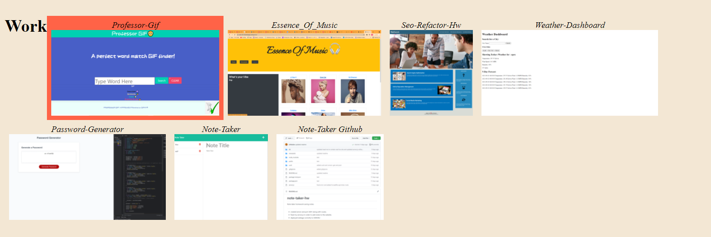
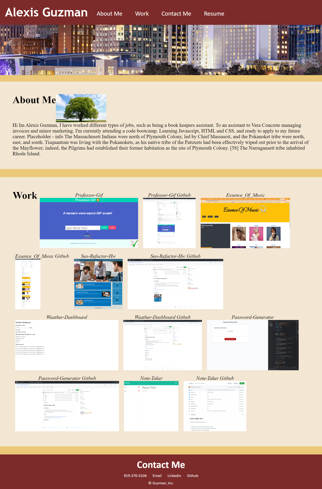

# portfolio-guzman-hw

## Updated Description
1. Improved CSS layout to be mobile-friendly 
2. Added projects and homework that worked.
3. added links to my resume, LinkedIn and GitHub
4. updated portfolio with new projects
5. updated portfolio to missing deployed sites and githubs.

## Links
1. [Homework Deployed Website link](https://liladobe.github.io/portfolio-guzman-hw/)
2. [Github](https://github.com/LilAdobe/portfolio-guzman-hw.git)

## Screenshot

